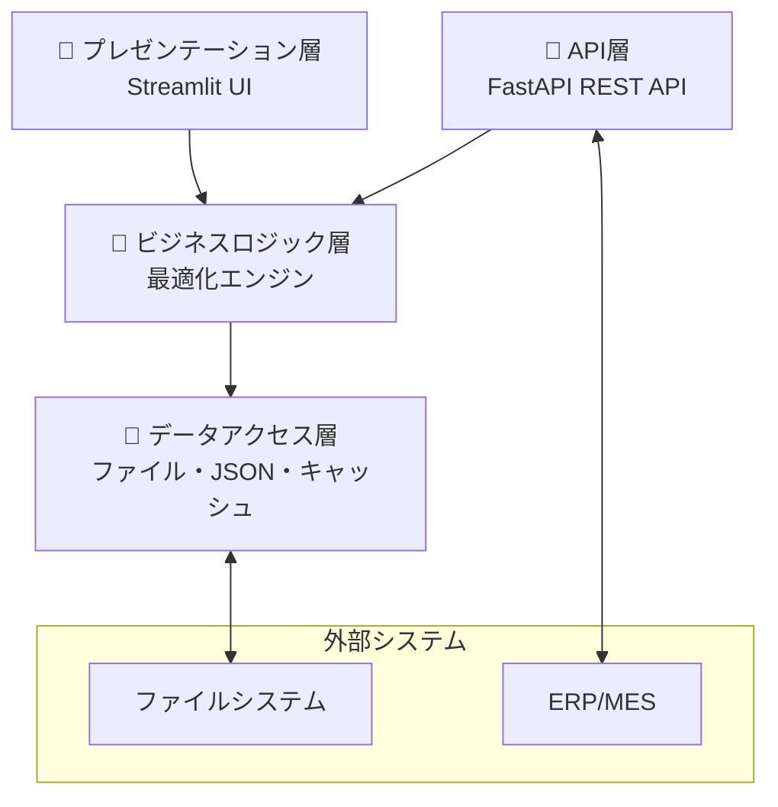
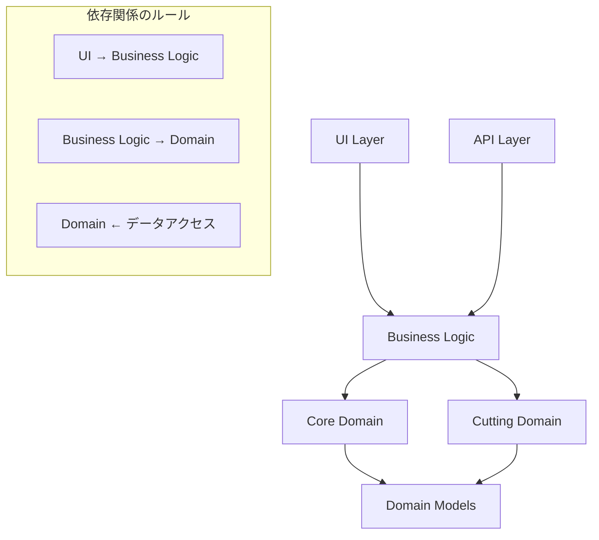
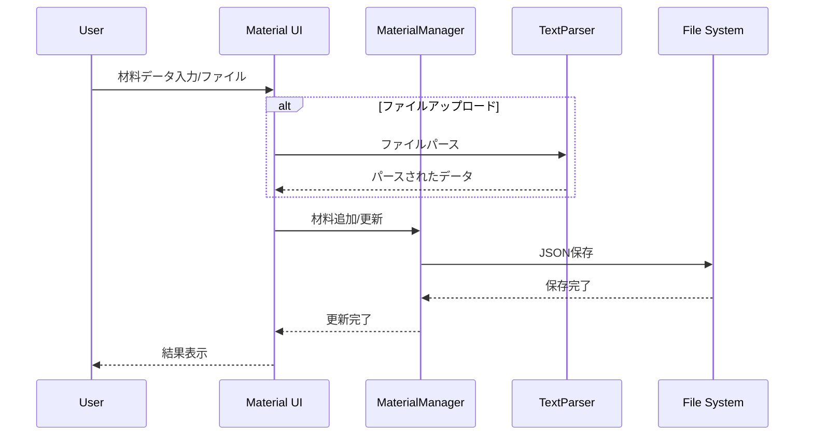
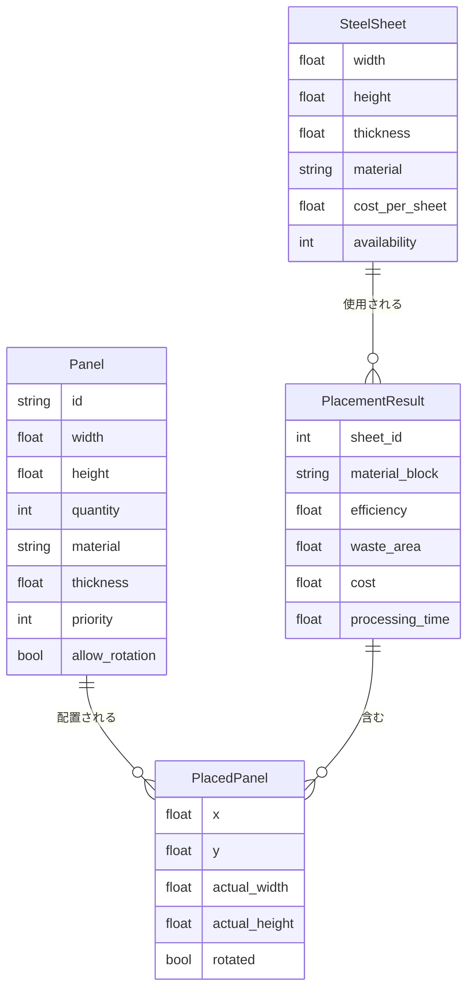
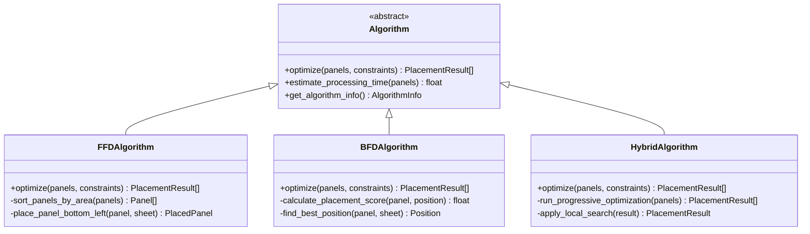
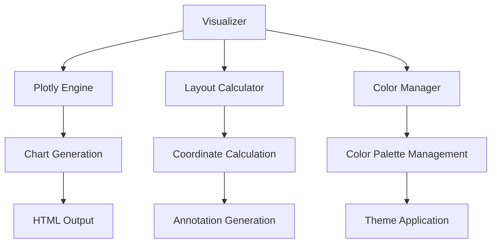
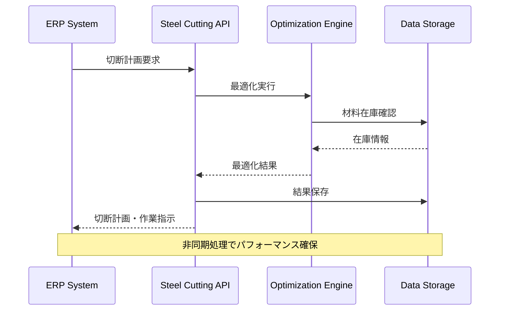

# アーキテクチャ概要 / Architecture Overview

鋼板切断最適化システム システム設計書

## 📖 目次 / Table of Contents

1. [🏗️ システム全体構成](#-システム全体構成)
2. [🧠 コアアーキテクチャ](#-コアアーキテクチャ)
3. [📊 データフロー](#-データフロー)
4. [⚡ アルゴリズム設計](#-アルゴリズム設計)
5. [🎨 UI/UXアーキテクチャ](#-uiuxアーキテクチャ)
6. [🔌 統合・連携層](#-統合連携層)
7. [🚀 パフォーマンス設計](#-パフォーマンス設計)
8. [🔒 セキュリティ設計](#-セキュリティ設計)

## 🏗️ システム全体構成

### アーキテクチャパターン
本システムは**レイヤードアーキテクチャ**を採用し、関心事の分離と保守性を重視した設計となっています。



### 主要コンポーネント

#### 1. プレゼンテーション層
- **Streamlit UI**: メインユーザーインターフェース
- **インタラクティブ可視化**: Plotlyによるリアルタイム表示
- **多言語対応**: 日英バイリンガルUI

#### 2. ビジネスロジック層
- **最適化エンジン**: 複数アルゴリズムの統合実行
- **材料管理**: 在庫管理・バリデーション
- **作業指示生成**: 切断手順の自動生成
- **品質管理**: チェックポイント・レポート生成

#### 3. データアクセス層
- **永続化**: JSON形式での設定・在庫保存
- **キャッシュ**: LRUキャッシュによる高速化
- **ファイル処理**: 複数形式のデータパース

#### 4. 統合層
- **REST API**: 外部システム連携
- **ERP/MESコネクタ**: 生産管理システム統合

## 🧠 コアアーキテクチャ

### ドメイン駆動設計 (DDD)
システムは製造業のドメイン知識を中心とした設計になっています。

```python
# ドメインモデル例
@dataclass
class Panel:
    """パネル - ドメインエンティティ"""
    id: str
    width: float
    height: float
    material: str

    def can_fit_in_sheet(self, sheet: SteelSheet) -> bool:
        """ビジネスルール: シートに収まるか判定"""
        return (self.width <= sheet.width and
                self.height <= sheet.height)

class MaterialInventoryManager:
    """材料在庫 - ドメインサービス"""
    def validate_panel_against_inventory(self, panel: Panel) -> ValidationResult:
        """ビジネスロジック: 在庫に対するパネル検証"""
        pass
```

### モジュール構成

```
steel-cutting-system/
├── 🧠 core/                     # ドメインコア
│   ├── models.py                # ドメインエンティティ
│   ├── optimizer.py             # 最適化ドメインサービス
│   ├── material_manager.py      # 材料管理ドメインサービス
│   ├── text_parser.py           # データ変換サービス
│   └── algorithms/              # アルゴリズム実装
│       ├── ffd.py              # First Fit Decreasing
│       ├── bfd.py              # Best Fit Decreasing
│       └── hybrid.py           # ハイブリッドアルゴリズム
├── ✂️ cutting/                  # 切断ドメイン
│   ├── instruction.py          # 作業指示ドメインサービス
│   ├── sequence.py             # 切断順序最適化
│   ├── validator.py            # 制約検証
│   ├── quality.py              # 品質管理
│   └── export.py               # レポート生成
├── 🎨 ui/                       # プレゼンテーション層
│   ├── components.py           # UIコンポーネント
│   ├── visualizer.py           # 可視化サービス
│   └── material_management_ui.py # 材料管理UI
├── 🔌 integration/              # 統合層
│   ├── api.py                  # REST APIエンドポイント
│   └── erp_connector.py        # 外部システム連携
└── 📊 config/                   # 設定・データ
    └── material_inventory.json # 材料在庫データ
```

### 依存関係の設計



## 📊 データフロー

### 主要データフロー

#### 1. 最適化実行フロー
```mermaid
sequenceDiagram
    participant U as User
    participant UI as Streamlit UI
    participant OPT as OptimizationEngine
    participant ALG as Algorithm
    participant MAT as MaterialManager
    participant VIZ as Visualizer

    U->>UI: パネルデータ入力
    UI->>MAT: 材料検証要求
    MAT-->>UI: 検証結果
    UI->>OPT: 最適化実行
    OPT->>ALG: アルゴリズム選択・実行
    ALG-->>OPT: 配置結果
    OPT-->>UI: 最適化結果
    UI->>VIZ: 可視化生成
    VIZ-->>UI: 切断レイアウト
    UI-->>U: 結果表示
```

#### 2. 材料管理フロー


### データモデル

#### エンティティ関係


## ⚡ アルゴリズム設計

### アルゴリズム選択戦略

```python
class OptimizationStrategy:
    """複雑度適応型アルゴリズム選択"""

    def select_algorithm(self,
                        panel_count: int,
                        diversity: float,
                        time_budget: float) -> str:

        complexity = self._calculate_complexity(panel_count, diversity)

        if complexity < 0.3 and time_budget > 1.0:
            return "FFD"      # 高速処理
        elif complexity < 0.7 and time_budget > 5.0:
            return "BFD"      # バランス型
        elif time_budget > 30.0:
            return "HYBRID"   # 最適化重視
        else:
            return "FFD_WITH_TIMEOUT"  # 時間制約対応
```

### アルゴリズム実装パターン



### ギロチンカット制約の実装

```python
class GuillotineConstraint:
    """ギロチンカット制約の実装"""

    def validate_placement(self, placed_panels: List[PlacedPanel]) -> bool:
        """配置がギロチン制約を満たすかチェック"""
        cut_lines = self._generate_cut_lines(placed_panels)
        return self._validate_guillotine_cuts(cut_lines)

    def _generate_cut_lines(self, panels: List[PlacedPanel]) -> List[CutLine]:
        """パネル配置から切断線を生成"""
        horizontal_lines = []
        vertical_lines = []

        for panel in panels:
            # 水平切断線
            horizontal_lines.append(CutLine(
                y=panel.y, start_x=0, end_x=sheet_width
            ))
            horizontal_lines.append(CutLine(
                y=panel.y + panel.height, start_x=0, end_x=sheet_width
            ))

            # 垂直切断線
            vertical_lines.append(CutLine(
                x=panel.x, start_y=0, end_y=sheet_height
            ))
            vertical_lines.append(CutLine(
                x=panel.x + panel.width, start_y=0, end_y=sheet_height
            ))

        return self._optimize_cut_sequence(horizontal_lines, vertical_lines)
```

## 🎨 UI/UXアーキテクチャ

### Streamlit アーキテクチャパターン

```python
# コンポーネント分離パターン
class PanelInputComponent:
    """パネル入力コンポーネント"""
    def render(self) -> List[Panel]:
        return self._render_input_interface()

class MaterialManagementComponent:
    """材料管理コンポーネント"""
    def render(self):
        return self._render_material_interface()

class VisualizationComponent:
    """可視化コンポーネント"""
    def render_cutting_layout(self, result: PlacementResult):
        return self._create_plotly_figure(result)
```

### 状態管理パターン

```python
# Streamlit セッション状態管理
class SessionStateManager:
    """セッション状態の統一管理"""

    @staticmethod
    def get_panels() -> List[Panel]:
        if 'panels' not in st.session_state:
            st.session_state.panels = []
        return st.session_state.panels

    @staticmethod
    def set_optimization_results(results: List[PlacementResult]):
        st.session_state.optimization_results = results

    @staticmethod
    def get_material_manager() -> MaterialInventoryManager:
        if 'material_manager' not in st.session_state:
            st.session_state.material_manager = MaterialInventoryManager()
        return st.session_state.material_manager
```

### 可視化アーキテクチャ



## 🔌 統合・連携層

### REST API設計

```python
# API レイヤーアーキテクチャ
@app.post("/api/v1/optimize")
async def optimize_cutting(request: OptimizationRequest) -> OptimizationResponse:
    """最適化API - 非同期処理対応"""

    # 1. リクエスト検証
    validated_request = await validate_optimization_request(request)

    # 2. ビジネスロジック層呼び出し
    optimization_engine = get_optimization_engine()
    results = await optimization_engine.optimize_async(
        panels=validated_request.panels,
        constraints=validated_request.constraints
    )

    # 3. レスポンス構築
    return build_optimization_response(results)
```

### ERP/MES連携アーキテクチャ



### データ交換フォーマット

```yaml
# 標準データ交換フォーマット
optimization_request:
  format: JSON
  schema_version: "1.0.0"
  required_fields:
    - panels[]
    - steel_sheet
  optional_fields:
    - constraints
    - algorithm_hint

optimization_response:
  format: JSON
  includes:
    - placement_results[]
    - work_instructions[]
    - quality_plans[]
    - validation_report
```

## 🚀 パフォーマンス設計

### 非同期処理アーキテクチャ

```python
class AsyncOptimizationEngine:
    """非同期最適化エンジン"""

    async def optimize_with_progress(self,
                                   panels: List[Panel],
                                   progress_callback: Callable):
        # ステップ1: 高速解生成
        quick_solution = await self._run_ffd_async(panels)
        await progress_callback(quick_solution, progress=0.3)

        # ステップ2: 効率改善
        if self._has_time_remaining():
            better_solution = await self._run_bfd_async(panels)
            await progress_callback(better_solution, progress=0.7)

        # ステップ3: 微調整
        final_solution = await self._apply_local_search(better_solution)
        await progress_callback(final_solution, progress=1.0)

        return final_solution
```

### キャッシュ戦略

```python
from functools import lru_cache
import hashlib

class OptimizationCache:
    """最適化結果のキャッシュ管理"""

    @lru_cache(maxsize=1000)
    def get_placement_score(self, layout_hash: str) -> float:
        """配置スコアのキャッシュ"""
        return self._calculate_placement_score(layout_hash)

    def generate_cache_key(self, panels: List[Panel], constraints: dict) -> str:
        """キャッシュキーの生成"""
        data = {
            'panels': [(p.width, p.height, p.material) for p in panels],
            'constraints': constraints
        }
        return hashlib.md5(json.dumps(data, sort_keys=True).encode()).hexdigest()
```

### メモリ管理

```python
class MemoryManager:
    """メモリ使用量の監視と最適化"""

    def __init__(self, max_memory_mb: int = 512):
        self.max_memory_mb = max_memory_mb
        self.current_usage = 0

    def monitor_optimization(self, process):
        """最適化プロセスの監視"""
        if self._get_memory_usage() > self.max_memory_mb * 0.8:
            self._trigger_garbage_collection()
            self._clear_temporary_caches()

        if process.time_elapsed > process.time_budget * 0.9:
            self._prepare_timeout_recovery()
```

## 🔒 セキュリティ設計

### 入力検証

```python
class InputValidator:
    """入力データの検証とサニタイゼーション"""

    def validate_panel_data(self, panel_data: dict) -> Panel:
        """パネルデータの検証"""
        # サイズ制約チェック
        if not (50 <= panel_data['width'] <= 1500):
            raise ValueError("Panel width must be between 50-1500mm")

        # SQL インジェクション対策
        material = self._sanitize_string(panel_data['material'])

        # 数値範囲チェック
        thickness = self._validate_numeric_range(
            panel_data['thickness'], min_val=0.1, max_val=50.0
        )

        return Panel(
            id=self._sanitize_string(panel_data['id']),
            width=panel_data['width'],
            height=panel_data['height'],
            material=material,
            thickness=thickness
        )
```

### API セキュリティ

```python
# 将来実装予定のセキュリティ機能
class APISecurityMiddleware:
    """API セキュリティミドルウェア"""

    async def authenticate_request(self, request: Request):
        """API キー認証"""
        api_key = request.headers.get("X-API-Key")
        if not self._validate_api_key(api_key):
            raise HTTPException(status_code=401, detail="Invalid API key")

    async def rate_limit_check(self, client_ip: str):
        """レート制限チェック"""
        if self._is_rate_limited(client_ip):
            raise HTTPException(status_code=429, detail="Rate limit exceeded")
```

### データプライバシー

```python
class DataPrivacyManager:
    """データプライバシー管理"""

    def anonymize_sensitive_data(self, data: dict) -> dict:
        """機密情報の匿名化"""
        anonymized = data.copy()

        # 個人情報の除去
        if 'operator_name' in anonymized:
            anonymized['operator_name'] = self._hash_identifier(
                anonymized['operator_name']
            )

        # コスト情報の一般化
        if 'cost_details' in anonymized:
            anonymized['cost_details'] = self._generalize_costs(
                anonymized['cost_details']
            )

        return anonymized
```

## 📈 拡張性・保守性

### プラグインアーキテクチャ

```python
class AlgorithmPlugin:
    """アルゴリズムプラグインの基底クラス"""

    @abstractmethod
    def get_algorithm_info(self) -> AlgorithmInfo:
        """アルゴリズム情報の提供"""
        pass

    @abstractmethod
    def optimize(self, panels: List[Panel], constraints: dict) -> List[PlacementResult]:
        """最適化の実行"""
        pass

# プラグイン登録
algorithm_registry = AlgorithmRegistry()
algorithm_registry.register("custom_genetic", GeneticAlgorithmPlugin())
algorithm_registry.register("simulated_annealing", SAAlgorithmPlugin())
```

### 設定管理

```python
class ConfigurationManager:
    """設定の統一管理"""

    def __init__(self):
        self.config = self._load_configuration()

    def _load_configuration(self) -> dict:
        """設定ファイルの読み込み"""
        return {
            'algorithms': {
                'default_timeout': 30,
                'memory_limit_mb': 512,
                'enable_parallel': True
            },
            'ui': {
                'default_language': 'ja',
                'theme': 'light',
                'enable_animations': True
            },
            'integration': {
                'api_port': 8000,
                'enable_cors': True,
                'rate_limit_per_minute': 100
            }
        }
```

### ログ・監視

```python
import logging
from datetime import datetime

class SystemMonitor:
    """システム監視とログ管理"""

    def __init__(self):
        self.logger = self._setup_logger()

    def log_optimization_performance(self,
                                  panel_count: int,
                                  algorithm: str,
                                  processing_time: float,
                                  efficiency: float):
        """最適化パフォーマンスのログ"""
        self.logger.info(f"Optimization completed", extra={
            'panel_count': panel_count,
            'algorithm': algorithm,
            'processing_time': processing_time,
            'efficiency': efficiency,
            'timestamp': datetime.now().isoformat()
        })

    def _setup_logger(self) -> logging.Logger:
        """ログ設定の初期化"""
        logger = logging.getLogger('steel_cutting_system')
        handler = logging.FileHandler('logs/system.log')
        formatter = logging.Formatter(
            '%(asctime)s - %(name)s - %(levelname)s - %(message)s'
        )
        handler.setFormatter(formatter)
        logger.addHandler(handler)
        return logger
```

---

## 📚 関連ドキュメント / Related Documentation

- [📋 **プロジェクト仕様書**](../steel_cutting_spec.md) - 詳細技術仕様
- [📖 **ユーザーガイド**](user_guide.md) - 操作手順書
- [📊 **API リファレンス**](api_reference.md) - REST API仕様
- [⚙️ **開発ガイド**](../CLAUDE.md) - 開発者向け情報

---

**最終更新**: 2025年1月22日 | **アーキテクチャバージョン**: v1.0.0